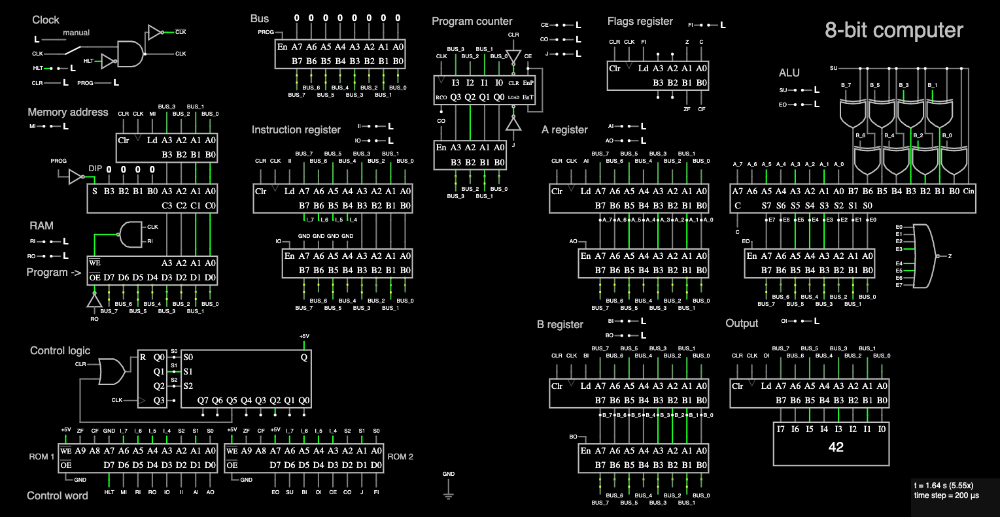

# Build an 8-bit computer in CircuitJS1

This repo contains simulations and notes for Ben Eater's project to [build an 8-bit computer from scratch](https://eater.net/8bit).

His [series of videos](https://www.youtube.com/playlist?list=PLowKtXNTBypGqImE405J2565dvjafglHU) is amazing and I highly recommend them.

I didn't have the kit, so rather than build the project on breadboards, I created simulations of each module using [CircuitJS1](https://github.com/pfalstad/circuitjs1), an electronic circuit simulator that runs in the browser. I found this very useful for playing with the components and modules to build understanding.

You can read through the notes I made as I went through the videos, and the circuits as they evolved, in [this branch](https://github.com/tomwhite/8-bit-computer/tree/development-progress).



## Try it out

Download [computer.circuitjs.txt](computer.circuitjs.txt) from this repository onto your computer. (Checkout the whole repository if you want to do more than run the built-in "add" program.)

Open the [full screen version of CircuitJS1](http://falstad.com/circuit/circuitjs.html), preferably on a computer with a large monitor!

Select File | Open File... in the menu, and choose the computer.circuitjs.txt file you downloaded.

The computer's RAM is pre-loaded with the "add" program like the one described in [8-bit CPU control logic: Part 1](https://www.youtube.com/watch?v=dXdoim96v5A) (although in that video it was run by hand).

Click the switch in the top left hand corner to connect the clock, then watch the computer run the program. After a while the output should display 42, and the computer will enter the halt state (HLT will be high in the clock section).

To run again, take CLR high (in the clock section - click on the L next to CLR) to reset. You can also switch the clock to manual mode and click on the L input to pulse the clock. This is useful for stepping through a program to understand what is happening in various registers and on the bus.

### Running programs

Assembler code for programs from various videos can be found in the programs directory. Convert to machine code by running `python assemble.py` followed by the source filename. For example:

```shell
python assemble.py programs/add_sub.asm
```

This will output the contents to copy into the RAM (where it says "Program ->"). Double click on the component and paste in the contents. For example, this is the contents for `add_sub.asm`:

```
0: 31
1: 46
2: 61
3: 224
4: 240
13: 7
14: 6
15: 5
```

You can then run the program as described earlier.

### Building ROMs

There are two ROMS (for the EEPROMs), one from the [Reprogramming CPU microcode with an Arduino](https://www.youtube.com/watch?v=JUVt_KYAp-I) video, and one that uses the flags register that was added later to do conditional logic (see [Conditional jump instructions](https://www.youtube.com/watch?v=Zg1NdPKoosU)).

To re-generate a ROM, run

```shell
python microcode-with-flags.py
```

Then to view it run

```shell
hexdump -Cv roms/microcode-with-flags.rom
```

Then load a copy into _both_ ROM 1 and ROM 2 in the circuit simulator.

### Manual control logic

To control the computer manually - i.e. at the stage before the control logic was added - you need to disconnect the Control logic module. It's simplest to just delete it. Then connect the control line nodes so they can be set manually.

For example, to load a value from the bus to the A register:

- Enable PROG (set it to H)
- Enter a number on the bus
- Turn AI on (set it to H)
- Advance the clock
- On next rising clock edge the number will be loaded into A
- Turn AI off (set it to L)
- Disable PROG (set it to L)

## Implementation details and differences from the original

CircuitJS1 provides a lot of "idealised" components which I used instead of actual integrated circuits. The key ones I used were:

- For the clock module I used CircuitJS1's built in clock component. I added some logic to allow manual stepping too. (But you can find a clock circuit simulation that uses 555 timers like the videos in the _1.clock.circuitjs.txt_ file in the [development-progress branch](https://github.com/tomwhite/8-bit-computer/tree/development-progress).)
- To build registers I used CircuitJS1's tri-state buffers and custom logic components. (You can see how these work in "register" CircuitJS1 files in the [development-progress branch](https://github.com/tomwhite/8-bit-computer/tree/development-progress).)
- For the ALU I used CircuitJS1's adder component.
- I didn't add the DIP switches for the RAM data lines, since CircuitJS1 allows you to edit the contents of the SRAM directly.
- For the program counter, in CircuitJS1 the 74LS161 4-bit binary counter is represented by the "counter with load" component.
- For the output display we can cheat since there is a decimal display component, so there is no need to do any binary to decimal conversion.

Since it's a simulation the computer runs a lot slower than a real circuit. With the clock set to 200Hz, the time step 200u (microseconds), and a the Simulation Speed pushed right up, it is just about fast enough for most programs, but is not as fast as the videos.
